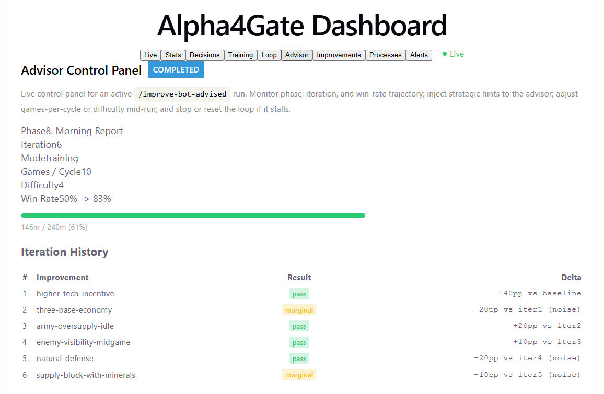
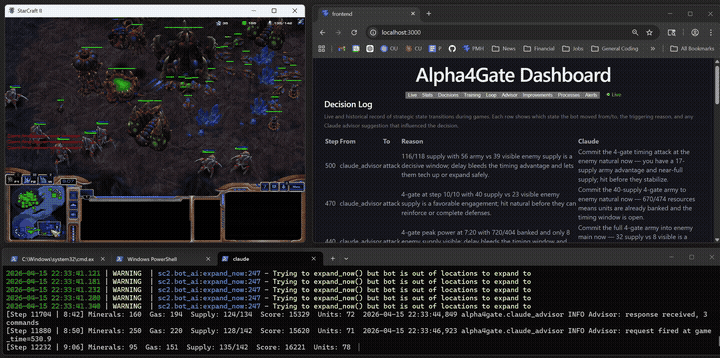
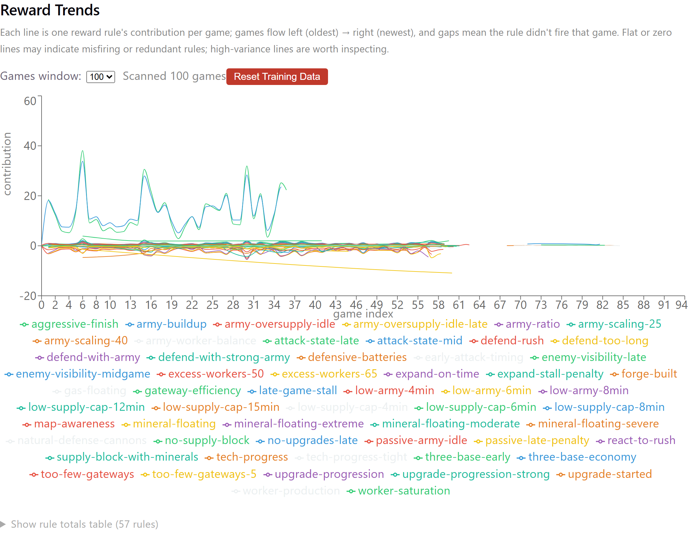

# Alpha4Gate

   

An AI agent that teaches itself to get better at a task with <i><b>- zero human input</b></i>.

It plays, watches itself fail, figures out why, writes a fix, proves the fix works, and repeats. The task happens to be StarCraft II, but the loop is general. A live React dashboard streams every phase — every proposed fix, every rejection, every win-rate swing — while the agent runs unattended for hours.  (Techincally an iterative LLM-guided reinforcement learning model with a learned advisor)

<table>
<tr>
<td width="33%" valign="top" align="center">
<a href="documentation/images/advisor-completed.png"></a>
<br/><sub><b>Self-improvement loop</b><br/>6 fixes proposed, validated, committed</sub>
</td>
<td width="33%" valign="top" align="center">
<a href="documentation/images/sc2-gameplay.gif"></a>
<br/><sub><b>Live capture</b><br/>Game, advisor decisions, and backend logs streaming together</sub>
</td>
<td width="33%" valign="top" align="center">
<a href="documentation/images/reward-trends.png"></a>
<br/><sub><b>Monitoring</b><br/>Per-rule reward contribution over recent games</sub>
</td>
</tr>
</table>

> **50% → 83%** win rate at SC2 difficulty 4 — reached via 6 code changes the agent wrote and validated itself.

## What makes this different

Most self-improving ML systems need a human in the loop for reward design, tuning, or debugging. This one closes that loop:

- **Claude reads telemetry like a reviewer** — names the specific failure ("attacked before the economy caught up"), not just a scalar reward. Ranked fixes with reasoning.
- **Fixes are real code changes.** With `--self-improve-code`, Claude edits the bot's source on a feature branch and must pass pytest / mypy / ruff before anything ships.
- **Every fix is validated before commit.** A change that doesn't hold up over N games is auto-reverted — no silent regressions.
- **You can watch it happen.** The dashboard streams every phase, proposal, rejection, and win-rate swing live while the agent runs unattended for hours.

The architecture is task-agnostic — SC2 is the test case because it gives fast, machine-readable outcomes.

---

## The autonomous learning loop

```
                    ┌──────────────────────────────────────────────────────┐
                    │          /improve-bot-advised                        │
                    │       autonomous learning loop (4+ hours)            │
                    │                                                      │
  ┌─────────┐       │   ┌─────────┐    ┌─────────┐    ┌─────────┐          │
  │         │       │   │         │    │         │    │         │          │
  │   THE   │◄─────────►│  PLAY   │───►│  THINK  │───►│  FIX    │          │
  │   TASK  │       │   │         │    │         │    │         │          │
  │         │       │   └─────────┘    └─────────┘    └────┬────┘          │
  │ (SC2)   │◄──┐   │                                      │               │
  │         │   │   │   ┌─────────┐    ┌─────────┐    ┌────▼────┐          │
  │         │   └──────►│  TRAIN  │◄───│ COMMIT  │◄───│  TEST   │          │
  │         │       │   │         │    │         │    │         │          │
  └─────────┘       │   └─────────┘    └─────────┘    └─────────┘          │
                    │         │                                            │
                    │         └──────── loop back to PLAY ──────────────►  │
                    │                   (or stop if time's up / 3 fails)   │
                    └──────────────────────────────────────────────────────┘
```

The loop runs unattended for hours. Each cycle: play N games, Claude reads the results and proposes ranked fixes, apply one, re-run N games to validate, commit if it held, retrain the neural policy, repeat. Quality gates (pytest/mypy/ruff), auto-rollback, a wall-clock budget, and a 3-fail cap keep it safe.

**Read the full architecture:** [improve-bot-advised-architecture.md](documentation/wiki/improve-bot-advised-architecture.md)

---

## How we watch it run

```
      autonomous learning loop                  StarCraft II game
      ─────────────────────────                  ─────────────────
      PLAY → THINK → FIX →                       (THE TASK)
      TEST → COMMIT → TRAIN
               ▲                                        ▲
               │                                        │
        observe the loop                         observe the game
               │                                        │
      ┌────────┴────────┐                      ┌────────┴────────┐
      │ Advisor tab     │                      │ Live tab        │
      │ run log         │                      │ /ws/game        │
      │ state.json      │                      │ JSONL logs      │
      └─────────────────┘                      └─────────────────┘
```

Two things are running: the **loop** and the **task** it's learning from. The dashboard has a tab tuned to each vantage point, plus `data/advised_run_state.json` as the single source of truth for which phase is executing right now. Stuck-loop detection, alert rules, and operator overrides all hang off these two views.

**Read the full monitoring guide:** [monitoring.md](documentation/wiki/monitoring.md)

---

## Why not just have Claude do everything?

Claude is good at **thinking** and slow at **acting**; real-time games need the reverse. A Claude CLI call takes seconds to respond, but the bot observes the game every ~0.5s and issues dozens of actions per second during fights.

So the tight loop runs on rule-based strategy + a PPO policy network (both decide in milliseconds). Claude is used only where latency doesn't matter: mid-game advice (fire-and-forget, rate-limited), post-hoc diagnosis between batches, and writing the fix itself.

Fast-and-dumb does the playing. Slow-and-smart does the learning.

---

# The Story So Far of Alpha4Gate

- **Original Motivation -** Beat my friend at a video game using AI.
- **The basic bot -** A rule-based bot player that built units and hoped for the best. 
- **Teaching it to think -** Added a neural network so it could learn.
- **Learning to fight -** Targeted lessons: keep the army together, deny expansions, hold the line.
- **Bringing in a coach -** Claude whispers strategy tips mid-match alongside human commands.
- **The observation deck -** A live dashboard showing every decision, reward, and training run.
- **The robot that trains itself -** A daemon that plays, scores, promotes winners, and rolls back duds overnight.
- **The first soak test -** Left it alone — 17 things broke. Fixed them all.
- **Claude as personal trainer -** Claude watches games, diagnoses problems, and writes the fixes itself.
- **The breakthrough -** Self-improvement took win rate from 0% to 75% at difficulty 3.
- **Reality check -** Harder opponents exposed that training scores lie — need honest exams.
- **The big merge -** Three plans became one: every future bot is a snapshot that must beat its ancestors.
- **Phase A -** Added memory (LSTM) and a gentler training recipe — 19/20 wins at difficulty 3.
- **The arena works -** Two bot versions fighting each other in separate sandboxes, validated.
- **Now -** Packaging the current bot as "v0" — the first official entry in the lineage.

---

<details>


<summary><b>Stack</b></summary>

| Layer | Tool | Why |
|---|---|---|
| Language | Python 3.12 | SC2 libraries are Python-native |
| SC2 interface | burnysc2 v7.1.3 | Async BotAI, actively maintained |
| AI advisor | Claude CLI (OAuth or API key) | Strategic advice mid-game, async subprocess |
| Build orders | Spawning Tool API | Community build order database |
| Backend | FastAPI | WebSocket + REST for dashboard |
| Frontend | React + TypeScript + Vite | Live dashboard with game state streaming |
| Deep learning | PyTorch + Stable Baselines 3 | PPO policy network for strategic decisions |
| Training data | SQLite | Structured (s,a,r,s') transition storage |
| Charts | Recharts 3.8 | Per-rule reward trend visualization |
| Testing (Python) | pytest | 829 unit tests, SC2 integration markers |
| Testing (Frontend) | vitest + jsdom + @testing-library/react | 126 component / hook / lib tests |
| Linting | ruff + mypy | Strict type checking, consistent style |

</details>

<details>

<summary><b>Setup</b></summary>

### Prerequisites

- Windows 11
- StarCraft II installed at `C:\Program Files (x86)\StarCraft II\`
- Python 3.12+
- [uv](https://docs.astral.sh/uv/) package manager
- Node.js 18+ (for React frontend)
- SC2 maps from [Blizzard CDN](https://blzdistsc2-a.akamaihd.net/MapPacks/Melee.zip) (password: `iagreetotheeula`) — do NOT use GitHub map files (Git LFS pointers)

### Install

1. Install Python dependencies:
   ```bash
   cd Alpha4Gate
   uv sync
   ```

2. Create `.env` from template and fill in your keys:
   ```bash
   cp .env.example .env
   # Edit .env: set SC2PATH, SPAWNING_TOOL_API_KEY
   # Claude advisor auth: claude CLI must be on PATH with OAuth token or API key
   ```

3. Install frontend dependencies:
   ```bash
   cd frontend && npm install && cd ..
   ```

### Dashboard

```bash
# One-shot: start backend + frontend together (Git Bash)
bash scripts/start-dev.sh

# Or in two terminals:
# Terminal 1: backend
uv run python -m alpha4gate.runner --serve

# Terminal 2: frontend dev server
cd frontend && npm run dev
# Opens http://localhost:3000 proxying to :8765
```

</details>

<details>
<summary><b>Dashboard tabs</b></summary>

| Tab | Purpose |
|---|---|
| Live | Real-time game state stream (WebSocket) |
| Stats | Cross-game win rates and aggregate stats from training.db |
| Decisions | Live decision log with rule firings and Claude advice |
| Training | Model comparison + improvement timeline + checkpoint list + reward rule editor |
| Loop | Daemon state, trigger evaluation, full daemon control panel |
| Advisor | Live advised-run status, loop controls, strategic hints, reward injection |
| Improvements | Recent promotions/rollbacks + per-rule reward trend chart |
| Processes | Live system process monitor, port status, state files, backend restart |
| Alerts | Severity-filtered alert list with ack/dismiss + unread badge in nav |

In-app `AlertToast` lives at the App root and shows new alerts as they fire, regardless of which tab is active.

</details>

<details>
<summary><b>Usage</b></summary>

### Run a game

```bash
# Single game vs Easy AI
uv run python -m alpha4gate.runner --map Simple64

# Options
--difficulty 3       # AI difficulty 1-10 (default: Easy)
--realtime           # Watch in realtime
--batch 5            # Run 5 games, aggregate stats
--build-order 4gate  # Select build order (default: 4gate)
--serve              # Start dashboard API server only
--no-claude          # Disable Claude advisor
```

### Running without Claude

The Claude advisor is optional. Pass `--no-claude` (or simply don't install the `claude` CLI) and the bot runs entirely on its rule-based strategy + optional PPO policy. Skip step 2's Claude-auth note during setup.

What still works without Claude:

| Feature | Notes |
|---|---|
| Rule-based play vs SC2 AI | `uv run python -m alpha4gate.runner --no-claude --difficulty 3` |
| Batch runs + stats aggregation | `--batch 10 --no-claude` |
| Neural (PPO) play and training | Rule-based or hybrid decision mode; training loop is Claude-free |
| Dashboard — Live, Stats, Decisions, Training, Loop, Improvements, Processes, Alerts | All tabs render and update as normal |
| Build order editor + reward rule editor | Pure local config |
| Command panel — Human Only / Hybrid modes | Natural-language command parser runs locally |
| Daemon loop (auto-training, promotion, rollback) | Does not call Claude |

What needs Claude:

- **Advisor tab** and the `/improve-bot-advised` autonomous improvement loop
- **Live strategic advice** shown on the Live tab mid-game
- **AI-Assisted command mode** (falls back gracefully if unavailable)

Quick start without Claude:

```bash
uv sync
cd frontend && npm install && cd ..
uv run python -m alpha4gate.runner --map Simple64 --difficulty 3 --no-claude --realtime
# In another terminal, watch the dashboard:
bash scripts/start-dev.sh
```

</details>

<details>
<summary><b>Testing & project structure</b></summary>

### Testing

```bash
uv run pytest              # 829 unit tests (no SC2 needed)
uv run pytest -m sc2       # SC2 integration tests (SC2 must be running)
uv run ruff check .        # Lint
uv run mypy src            # Type check
cd frontend && npx tsc --noEmit  # TypeScript check
```

### Project layout

```
Alpha4Gate/
├── src/alpha4gate/          # 47 Python modules
│   ├── commands/            # Strategic command system (parser, interpreter, executor, queue)
│   ├── bot.py               # Main BotAI subclass, game loop orchestration
│   ├── decision_engine.py   # Strategic state machine (6 states)
│   ├── neural_engine.py     # PPO policy integration with SB3
│   ├── army_coherence.py    # Staging, grouping, engagement/retreat
│   ├── fortification.py     # Cannons + batteries + FORTIFY state
│   ├── macro_manager.py     # Economy, production, expansion
│   ├── micro.py             # Kiting, focus fire, abilities
│   ├── claude_advisor.py    # Async Claude CLI subprocess
│   ├── trainer.py           # PPO training orchestrator
│   ├── features.py          # Game state -> tensor encoding
│   ├── rewards.py           # Configurable reward shaping
│   ├── imitation.py         # Imitation pre-training from replays
│   ├── api.py               # FastAPI server (REST + WebSocket)
│   └── ...                  # scouting, config, logger, runner, etc.
├── tests/                   # 829 unit tests (+ SC2 integration markers)
├── frontend/                # React + TypeScript dashboard (Vite)
├── scripts/                 # Live test, training analysis, model evaluation
├── documentation/wiki/      # Project wiki (start with index.md)
├── documentation/plans/     # Active plans (alpha4gate-master-plan.md)
├── documentation/archived/  # Completed plans (Phase 1, Phase 2, improvement cycles)
├── data/                    # Cross-game stats, training DB, checkpoints (gitignored)
├── logs/                    # JSONL game logs (gitignored)
└── replays/                 # SC2 replays (gitignored)
```

</details>

<details>
<summary><b>How the bot plays — layers & design decisions</b></summary>

### Layered architecture

```
Claude Advisor (async, non-blocking subprocess)
        |
Neural Engine — PPO policy network (optional, hybrid or pure RL mode)
        |
Strategy Layer — state machine: opening -> expand -> attack -> defend -> fortify -> late_game
        |
Command System — parser -> interpreter -> executor (AI-Assisted / Human Only / Hybrid)
        |
Tactics Layer — macro manager, scouting, production balance
        |
Coherence — army staging, grouping, engagement/retreat decisions
        |
Micro Layer — army movement, kiting, focus fire, ability usage
```

The bot follows a build order during the opening, then transitions to dynamic decision-making. Claude provides optional strategic advice via async subprocess calls (rate-limited to 1 per 30 game-seconds). The neural engine can override or supplement rule-based strategy decisions using a PPO-trained policy.

### Key design decisions

- **Layered separation**: Strategy, tactics, coherence, and micro are independent modules with clear interfaces, testable in isolation
- **Async Claude advisor**: Fire-and-forget subprocess call, bot never blocks waiting for AI advice
- **Deep learning pipeline**: PPO policy via Stable Baselines 3, SQLite transition storage, imitation learning bootstrap, gymnasium environment wrapping SC2 state. Hybrid mode combines neural + rule-based decisions
- **Strategic command system**: Three execution modes (AI-Assisted, Human Only, Hybrid), natural language parser with recipe library, command queue with priority and TTL
- **Defensive fortification**: FORTIFY strategic state triggered by threat assessment, BuildBacklog for deferred production retry, FortificationManager places cannons and shield batteries at expansion choke points
- **Army coherence**: Staging areas outside enemy range, group-based engagement with critical mass gate, retreat decisions based on relative army strength
- **JSONL logging**: Extended schema with `strategic_state`, `decision_queue`, and `claude_advice` for decision debugging
- **Cross-game persistence**: JSON files in `data/` and SQLite for training transitions
- **Build order system**: Named build orders importable from Spawning Tool API, sequenced by supply thresholds

</details>

---

**Wiki:** [documentation/wiki/index.md](documentation/wiki/index.md) — system diagram + page map
**Active plan:** [documentation/plans/alpha4gate-master-plan.md](documentation/plans/alpha4gate-master-plan.md)
